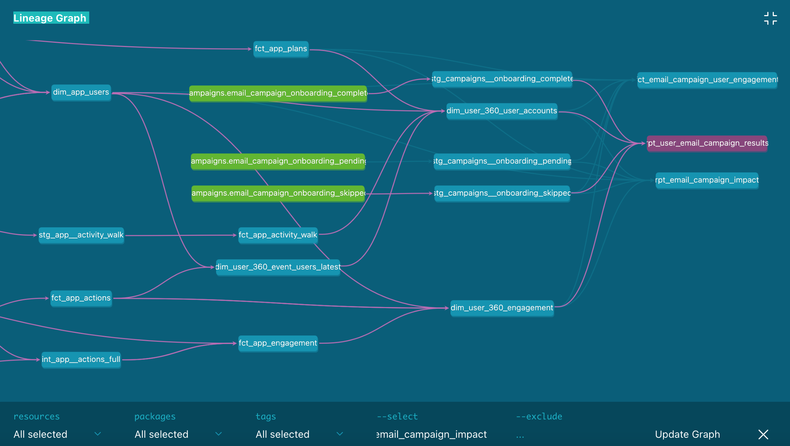
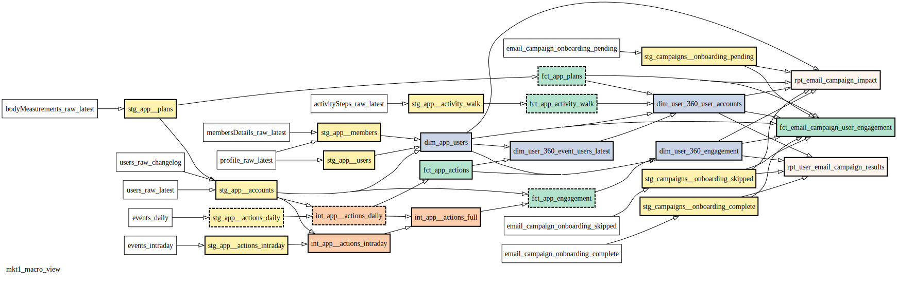
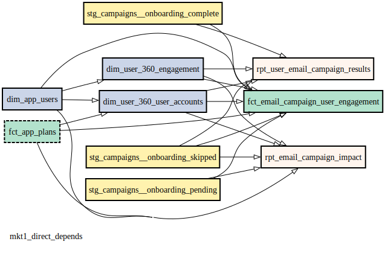
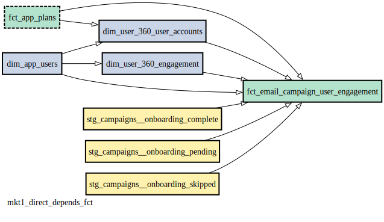
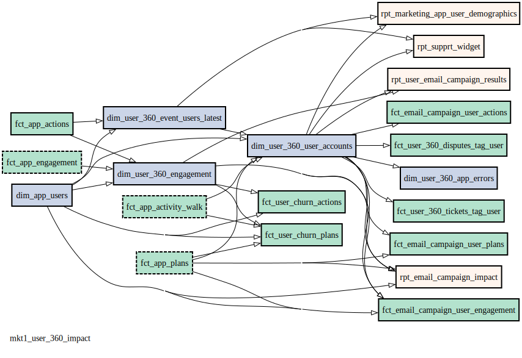

#  Better dbt Model Lineage Diagrams with dbt_dotdiag

Publication-quality lineage diagrams for dbt projects
##  Introduction

dbt (data build tool) is a popular open-source framework for transforming raw warehouse data into production-ready data marts using version-controlled yaml configuration files and modular SQL. Beyond transformation, dbt can automatically generate a comprehensive documentation site using a project’s source code, metadata, and embedded documentation. This documentation portal includes an interactive lineage graph that spans the entire project, and provides pan, zoom, and filter features to navigate complex model dependencies.

While dbt’s interactive GUI is excellent for exploration, it presents significant hurdles when these diagrams are needed for external reference or reports. Because the interface lacks a native export function, users are forced to rely on screen captures—a process that invariably leads to a loss of image fidelity. Furthermore, the inherent constraints on styling and layout within the browser can reduce the overall readability of complex models. dbt_dotdiag addresses these gaps by transforming the same project metadata into polished, publication-ready lineage diagrams.

## A Comparison

**Figure 1** is a screen capture of a dbt document server lineage diagram. The viewport was sized to fit approximately four levels of model dependency, large enough to useful for exploration and analysis.


<p align="center"> 
 
<br> 
<b>Figure 1:</b> <i>A typical dbt document server lineage diagram.</i> 
</p>

*Figure 1: A typical dbt document server lineage diagram.*

**Figure 2** was generate using `dbt_dotdiag` and is comparable Figure 1 with respect to the total number of models and complexity and depth of lineage.

<p align="center"> 
 
<br> 
<b>Figure 2:</b> <i>Comparable diagram (to figure 1) generated by dbt_dotdiag.</i> 
</p>

*Figure 2: Equivalent diagram (to figure 1) generated by dbt_dotdiag.*

 When comparing figures 1 and 2 it's clear that `dbt_dotdiag` provides several significant enhancements for formal documentation:

 - **Superior Readability:** The diagram utilizes a high-contrast, black-on-white color scheme. When paired with a streamlined node layout, this design ensures clarity for both digital viewing and high-resolution print.
    
 - **Hierarchical Optimization:** By leveraging the **Graphviz DOT** engine—specifically designed for directed acyclic graphs—the tool produces a more logical and compact hierarchy. This reduced canvas size allows for larger, more legible text without sacrificing project context.
    
 - **Enhanced Semantic Cues:** The tool adds visual layers of information through standardized styling. Nodes are color-coded by dbt layer (staging, intermediate, fact, or dimension), while border styles indicate materialization strategies: solid for `tables`, dashed for `incremental` models, and borderless for `views`.
 
-  **Native Export Support:** Unlike the browser-based documentation portal, **dbt_dotdiag** natively supports multiple export formats, including **PNG, SVG, and PDF**, ensuring compatibility with various publishing requirements.

## How dbt_dotdiag works

**dbt_dotdiag** leverages the `manifest.json` file—a core artifact generated by dbt during the compilation or documentation process (as detailed in the "Setting it up" section). This single source file contains all the metadata necessary for the tool to map project relationships and render the lineage diagram.

The tool is a Python-based application driven by a Command Line Interface (CLI). It supports the following parameters:

- **Core Target Models** (`--target-models`): Accepts one or more model names as a comma-separated string. This set forms the "anchor" of the diagram from which dependencies are traced.
    
- **Parent Depth** (`--parent-depth`): Specifies the number of upstream dependency levels to include. A depth of `1` restricts the view to the immediate sources or parents of the target models.
    
- **Child Depth** (`--child-depth`): Specifies the number of downstream dependency levels to include. A depth of `1` shows only the models immediately impacted by the target models.
    
- **Exclude Filter** (`--filter-models`): Filters out specific models using a regular expression. For instance, providing `"rpt_.*"` would exclude all reporting layer models from the resulting diagram.
    
- **Manifest Path** (`--manifest-path`): The file path to a valid dbt `manifest.json`. While the file may be renamed, it must retain the `.json` extension.
    
- **Output Path** (`--output-path`): The destination path for the generated diagrams. This path should include the **filename stem** only; the tool will automatically append the appropriate extensions (e.g., `.png`, `.svg`) based on the requested formats
    
- **Output Formats** (`--svg`, `--png`, `--jpg`, `--pdf`, `--dot`): Boolean flags that allow the user to generate the same diagram in multiple formats simultaneously. **Note**: the `--dot` option generates an ASCII file with the ".dot" extension. This file contains the complete instructions for regenerating the diagram written in the DOT scripting language. Graphviz can be used directly to create the various output formats using the dot file as the input.
    
- **Diagram Title** (`--title`): An optional string that, if provided, is rendered in the bottom-left corner of the diagram for easy identification.

- **Add Parameters to Legend** (`--show-details`): Adds several parameters to a legend in the diagrams that includes names of target models, parent and child depth, filter expression, and node border styles. 


## dbt_dotdiag in Action

### Intro

This section demonstrates how **dbt_dotdiag** can accelerate the process of mapping out an unfamiliar project area. By generating targeted diagrams, a developer can quickly move from high-level keyword searches to a functional understanding of model dependencies. The following example outlines a typical discovery workflow, including the specific CLI commands used and the resulting visualizations.

The following sections walk through a typical discovery workflow. We will follow a developer’s iterative process as they map out an unfamiliar project area, moving from a broad overview to a targeted investigation. Each step is organized as follows:

- **Objective:** A brief explanation of the developer's intent and the specific questions they are trying to answer.
    
- **The Command:** The exact Python command used to generate the lineage diagram.
    
- **Parameter Breakdown:** A technical explanation of why specific flags—such as depth and exclusion filters—were selected for that step.
    
- **Output Diagram:** The resulting publication-quality diagram generated by the tool.
    
- **Analysis:** A reflection on the visual results and how they inform the next stage of the investigation.

> **Note on Source Data:** The source data used in this demonstration is derived from an anonymized and redacted production environment. To protect confidentiality, model names have been anonymized, and all business logic has been removed. This includes column names, SQL code, configurations, and internal identifiers. The file used for this exercise, `manifest_anon.json` (included in this repository), contains only the structural model names and dependency mappings required to render the lineage.

> **Note on command parameters**: typically, the python source code, the dbt manifest file, and output diagrams would reside is separate directories. To make this exercise more accessible we have omitted the necessary file paths in the commands. Complete working version of the commands that generated the diagrams in this demo can be found in the file `dbt_dotdiag_scripts.md` under the repository folder `examples/scripts`
## Step 1: The Big Picture

Imagine you are tasked with supporting a new marketing initiative related to email campaigns. After searching the dbt documentation portal for relevant keywords, you identify a few core reporting and fact models related to email performance. However, while you have found the "destination," the upstream logic remains a "black box" of interconnected dependencies that are difficult to parse in a global project view.

### Step 1: The Macro View

**Objective:**

After identifying three key models related to email engagement and results via the dbt documentation portal, the immediate goal is to map their complete upstream lineage. This "bottom-up" view reveals every dependency—from raw sources to the final reporting layer—providing a comprehensive map of the data supply chain for these specific targets.

> **Note on Paths:** For clarity, absolute directory paths have been omitted from the following commands.

**Execution:**

```
python dbt_dotdiag.py \
  --target_models fct_email_campaign_user_engagement,rpt_user_email_campaign_results,rpt_email_campaign_impact \
  --child_depth 0 \
  --pdf --svg \
  --output_path fig3_mkt1_macro_view \
  --title mkt1_full_upstream \
  --manifest_path manifest_anon.json
```


**Parameter Breakdown:**

- **Target Models (`--target_models`):** Includes the three identified models as the anchor set for the diagram.
    
- **Child Depth (`--child_depth 0`):** Explicitly excludes downstream dependencies to focus solely on the "parent" logic.
- 
- **Parent Depth**: is omitted and the tool defaults to the full upstream tree.
    
- **Naming Convention:** The prefix `mkt1` is used for both the output filename and the diagram title to maintain organization and ensure traceability across multiple iterations.
    
- **Format Support (`--pdf`, `--svg`):** Generates two files - an SVG format diagram to be embedded in a document, and a PDF format diagram which is more convenient for viewing and sharing.


**Output Diagram:**

<p align="center"> 
 
<br> 
<b>Figure 3:</b> <i>The macro view.</i> 
</p>

*Figure 3: The macro view.*

**Analysis:**

The resulting diagram (Figure X) reveals a manageable lineage depth of five levels, encompassing 24 total models across the staging, intermediate, and fact layers, driven by 11 distinct sources. At this scale, the diagram remains highly legible on a standard 8.5" x 11" printout. This "war map" provides a physical reference that can be marked up throughout the investigation to track logic and identify potential bottlenecks.

## Step 2: Isolating Direct Dependencies

**Objective:**

With the "War Map" established, the investigation shifts to the immediate layer of the architecture. Much like panning or zooming in a GUI, the CLI allows for rapid recalibration of the diagram’s focus. By restricting the view to direct parents, you can audit the primary inputs of your target models and ensure they align with your expected design patterns.

> **Note:** Only modified parameters are highlighted in the breakdown below.

**Execution:**

```
python dbt_dotdiag.py \
  --target_models fct_email_campaign_user_engagement,rpt_user_email_campaign_results,rpt_email_campaign_impact \
  --child_depth 0 \
  --parent_depth 1 \
  --pdf --svg \
  --output_path fig4_mkt1_direct_depends \
  --title mkt1_direct_depends \
  --manifest_path manifest_anon.json
```

**Parameter Breakdown:**

- **Parent Depth (`--parent_depth 1`):** Limits the view to the first level of upstream dependencies. This isolates the immediate "sources" for the target set.
    
- **Updated Naming:** The output path and title are updated to reflect the narrowed scope of this specific audit.
    

**Output Diagram:**

<p align="center"> 
 
<br> 
<b>Figure 4:</b> <i>Isolating direct dependencies.</i> 
</p>

*Figure 4: Isolating direct dependencies.*

**Analysis:**

This direct view reveals a structural inconsistency: the models `dim_app_uses` and `fct_app_plans` appear as transitive dependencies in three unexpected instances. This architecture deviates from the intended star-schema design for this data mart and warrants further investigation into the upstream join logic.

### Refinement: Isolating Fact from Reporting

To further reduce visual noise and isolate specific layers of the transformation logic, you decide to split the target set into two distinct diagrams. This allows you to inspect the "Fact" logic and the "Reporting" logic as independent units.

**Revised Targets:**

1. **Fact Audit:** `--target_models fct_email_campaign_user_engagement`
    
2. **Report Audit:** `--target_models rpt_user_email_campaign_results,rpt_email_campaign_impact`
    

**Output Diagram:**

<p align="center"> 
 
<br> 
<b>Figure 5a:</b> <i>Direct dependencies, isolating reporting models.</i> 
</p>

*Figure 5a: Direct dependencies, isolating reporting models

<p align="center"> 
 
<br> 
<b>Figure 5b:</b> <i>Direct dependencies, isolating fact models.</i> 
</p>

*Figure 5b: Direct dependencies, isolating fact models.

**Analysis:**

By decoupling the campaign fact model from the reporting models, the lineage becomes significantly easier to interpret. The "Fact Audit" diagram now clearly shows the grain of the incoming data, while the "Report Audit" isolates the final-mile aggregations.

### Step 3: Mapping the Impact Radius

**Objective:**

Once your primary task is mapped, a natural next step in any investigation is to verify the "blast radius" of related entities. Here, we shift focus to the **User 360** models. By exploring a localized "impact radius"—one level upstream and one level downstream—you can quickly validate assumptions about how central dimensions interface with the rest of the project.

**Execution:**

```
python dbt_dotdiag.py \
  --target_models dim_user_360_user_accounts,dim_user_360_engagement \
  --child_depth 1 \
  --parent_depth 1 \
  --pdf --svg \
  --output_path fig6_mkt1_user_360_impact \
  --title mkt1_user_360_impact \
  --manifest_path manifest_anon.json
```

**Parameter Breakdown:**

- **Symmetrical Depth (`--parent_depth 1`, `--child_depth 1`):** Creates a focused "snapshot" of the models' immediate environment, showing both where they come from and what they directly influence.
    

**Output Diagram:**

<p align="center"> 
 
<br> 
<b>Figure 6:</b> <i>User 360 impact radius.</i> 
</p>

*Figure 6: User 360 impact radius*

**Analysis:**

The initial view confirms that these dimensions are heavily utilized. However, the presence of "churn" models adds unnecessary noise to this specific marketing-focused review.

### Refinement: Impact Radius, Excluding Churn

To finalize the diagram for long-term reference, you decide to prune the "out-of-scope" churn models. Additionally, you use the `--show-info` flag to embed the CLI configuration directly into the visual, transforming the diagram from a temporary view into a self-documenting asset.

**The Command:**

```
python dbt_dotdiag.py \
  --target_models dim_user_360_user_accounts,dim_user_360_engagement \
  --child_depth 1 \
  --parent_depth 1 \
  --exclude ".*churn.*" \
  --pdf --svg \
  --output_path fig7_mkt1_user_360_impact_no_churn \
  --title "User 360 Dimensions (Excluding Churn)" \
  --show-info \
  --manifest_path manifest_anon.json
```

**Revised Parameters:**

- **Regex Exclusion (`--exclude ".*churn.*"`):** Dynamically removes any models containing the string "churn," instantly cleaning the visual layout.
    
- **Self-Documentation (`--show-info`):** Appends a metadata legend to the bottom-left of the diagram, detailing the manifest source, filters, and depths used.
    
- **Human-Readable Title:** Replaces underscores with spaces and adds a newline for a professional, "presentation-ready" header.
    

**Output Diagram:**

<p align="center"> 
 
<br> 
<b>Figure 4:</b> <i>User 360 impact radius excluding churn.</i> 
</p>

Figure 7: Refinement: User 360 impact radius excluding churn*

**Analysis:**

By filtering for relevance and embedding the execution metadata, the diagram becomes a "single source of truth" for this sub-system. The embedded info-box ensures that if this PDF is shared or revisited months later, the context of the investigation—exactly what was included and excluded—remains perfectly clear.

## Dependencies

dbt_dotdiag has two external dependencies: graphviz and pygraphviz.

Graphviz is an open-source graph visualization application that represents structural information as diagrams of abstract graphs and networks. The software applies automated layout algorithms to organize these elements geometrically, optimizing for readability by balancing shapes and minimizing line crossings. Users create diagrams by describe nodes and edges in DOT, a simple human-readable text language. Graphviz supports the most common diagram output formats (SVG, PNG, JPEG, TIFF) as well as PDF. It is supported on Windows, Linux, Mac, and Solaris.

PyGraphviz is a Python interface to the Graphviz designed to let developers create and manipulate graphs programmatically. It acts as a wrapper around the underlying Graphviz C library, giving Python code direct access to Graphviz's powerful layout algorithms and the DOT language. Unlike lighter wrappers, PyGraphviz offers granular control over the graph attributes and structure by exposing the full Graphviz API.
## Installing Dependencies

### Installing graphviz

Official Graphviz installation is best done via official package managers or the [Graphviz download page](https://graphviz.org/download/).

### installing pygraphviz

Mac OS (if you installed graphviz using homebrew, otherwise a standard pip install)
```
pip install \
  --config-settings="--global-option=build_ext" \
  --config-settings="--global-option=-I$(brew --prefix graphviz)/include/" \
  --config-settings="--global-option=-L$(brew --prefix graphviz)/lib/" \
  pygraphviz
```

Linux
```
sudo apt update
sudo apt install graphviz libgraphviz-dev pkg-config
```

Windows
(Powershell)
```
pip install `
  --config-settings="--global-option=build_ext" `
  --config-settings="--global-option=-IC:\Program Files\Graphviz\include" `
  --config-settings="--global-option=-LC:\Program Files\Graphviz\lib" `
  pygraphviz
```

## Sample Manifest JSON File Provided

This repository contains the manifest_anon.json reference in the workflow demo as well as the commands (Mac and Linux format) and diagrams in SVG and PDF format. 
